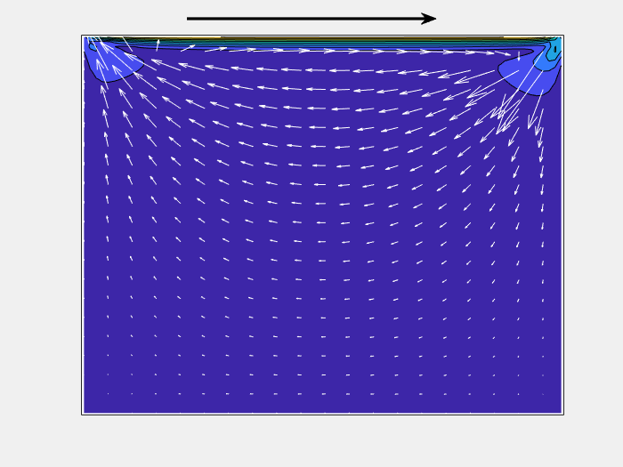

# 2D Lid Driven Cavity Flow

This repo provides a MATLAB example code for the lid-driven cavity flow where incompressible 
Navier Stokes equation is numerically solved using a simple 2nd order finite difference scheme on a staggered grid system.

## Part 1

Click [here](./docs/vanilaCavityFlow_EN.md) for detailed documentation

In order to focus on understanding basic idea of the numerical schemes, the method is kept premitive; explicit treatment of viscous term (the solution will diverge at low Reynolds number) and
the time integration is Euler.

まずは単純な手法でキャビティ流れのシミュレーションを実施します。日本語のドキュメントは[こちら](./docs/vanilaCavityFlow_JP.md) から

## Next to come

Plan is to implement the implicit treatment for viscous terms to obtain better stability.

# Environment

- MATLAB R2019b
- Signal Processing Toolbox if you use dct in solving Poisson eqn.

# ToDo

1. Implement implicit treatment of viscous terms
2. Imlement crank-Nicolson for the non-linear terms
3. Allow obstacles within the domain
4. Allow inflow from the wall
5. Make it to 3D

--

Copyright (c) 2020, The MathWorks, Inc.