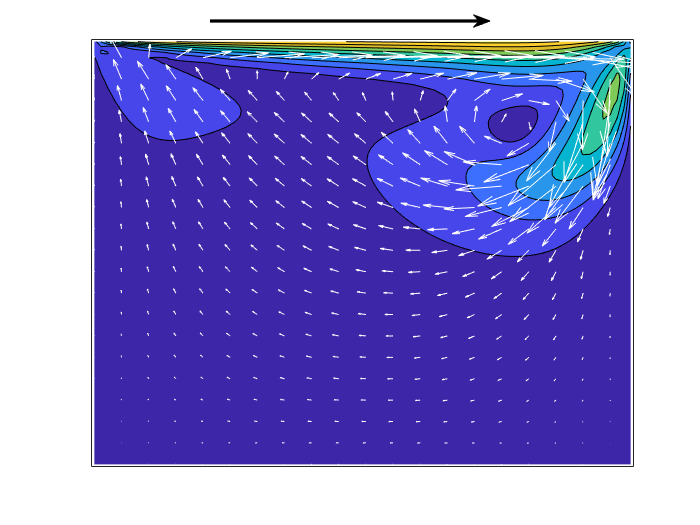
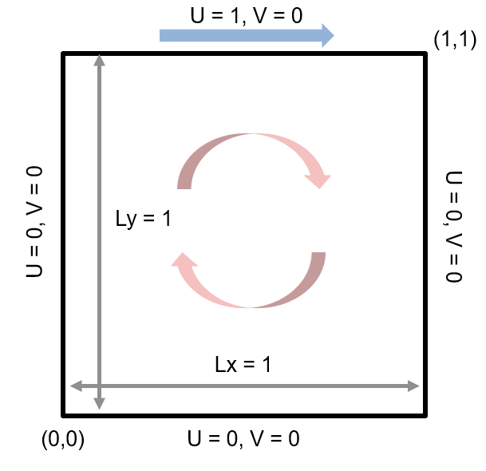
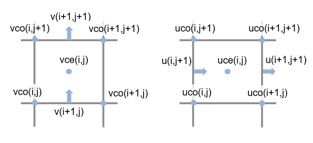
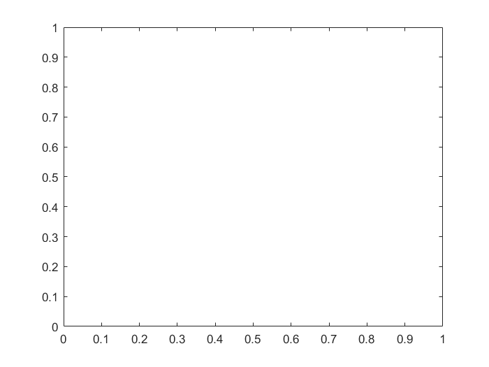
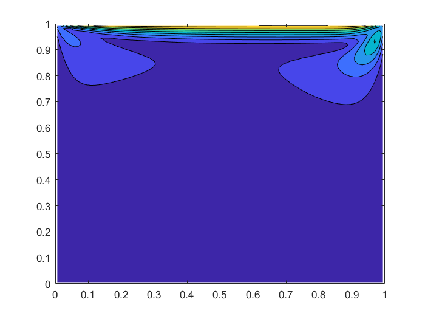

# CFD 101: Introduction to incompressible Navier-Stokes equation


Copyright (c) 2020, The MathWorks, Inc.


# Introduction


In this document, we describe the fractional step method to solve the incompressible Navier Stokes equation. This used discrete cosine transform described ([here](https://github.com/mathworks/Fast-Poisson-Equation-Solver-using-DCT)) for efficient computation.


I would like to re-introduce the scheme presented by Perot (1993) that beautifully discusses the boundary requirements for pressure.


# Goal of this document

   -  Draw the animation below 
   -  Understand the fractional step method 





## Warning


To focus on understanding the base ideas, the code presented here is primitive (1st order Euler and explicit treatment for the viscous terms). It tends to diverge if you change the Reynolds number to a smaller value or increase the number of the grid. I would like to discuss the countermeasure in the next chapter. (Not in this file)


  
# Why MATLAB for this task.


Numerical simulation is matrix calculation in the end, which MATLAB is good at. I'm hoping that MATLAB Coder and Parallel Computing Toolbox make it possible to generate the simulation code that works for the case requiring massively parallel computation.


## Environment

   -  MATLAB R2019b 
   -  Signal Processing Toolbox* 


*: It's recommended. The code below uses `dct` function from Signal Processing Toolbox in order to solve the Poisson equation for pressure, but this part can be replaced by iterative solver or directly inverting the matrices, which does not require any additional toolboxes. Examples are also provided.


# 2D Lid-driven cavity flow


This is the "Hello World" problem of CFD, which Ghia 1982 [1] is often referred to as a reference solution. Other conditions are


   -  the flow is incompressible  
   -  the domain is a square and staggered grid system with an evenly spaced grid.  
   -  the boundary condition is no-penetration, no-slip except for the lid, which is moving at the constant speed.  





# Fractional Step Method


The fractional step, or time-splitting, method solves the unsteady Navier-Stokes equations in a segregated manner. At each time step, an incomplete form of momentum equations is integrated to obtain an approximate velocity field, which is, in general, not divergence-free, then the velocity field is projected into the divergence-free field without changing vorticity. This projection step is achieved by solving the Poisson equation for pressure. This fractional step method was first suggested by Harlow and Welch (1965)[2] and Chorin Chorin (1968)[3]. 


The original scheme was improved for staggered grids formation by Kim and Moin Kim and Moin (1985)[4]. As mentioned by Perot Perot (1993)[5] the fractional step method has been used in the past by numerous researchers, but in general is first-order in time accuracy and there still exits some "serious confusion and/or disagreement concerning boundary conditions and the details of the methods implementation". 


Considerable effort has been spent to achieve higher-order accuracy in time integration. On the one hand, the first-order behavior is attributed to the use of the physical velocity boundary condition and zero normal pressure gradient, and several modifications on boundary conditions have been presented, for example, Le and Moin (1991)[6].


On the other hand, the first-order accuracy is claimed to be due to the commutation error shown by LU factorization scheme by Perot (1993)[5]. Perot suggested that no boundary condition is required for obtaining intermediate velocity and pressure. Later, Perot proposed the exact fractional step method (Chang (2002)[7]). The method has no splitting errors associated with the method, it satisfies the discrete incompressibility condition to machine precision automatically, and it successfully eliminates the pressure term from the momentum equations.


A range of projection/pressure correction methods has been invented. This document reviews Perot's LU decomposition analysis of the fractional step method.


# Method


The incompressible Navier-Stokes equations in primitive variables are given by the equation


Here the second-order central difference scheme is applied for space discretization and 1st order Euler for time discretization. When fully discretized above equation can be represented


 


or in the following matrix form,


where  is the indentity matrix,  is the convective operator,  is the gradient operator,  is the divergence operator,  is the explicit right-hand side of the momentum equation,  is the boundary condition vector for the incompressibility constraint.  and and


.


# LU representation of the fractional step method


The fractional step method is related to the block LU factorization (Perot 1993)


If you denote 


with the intermediate velocity  then we obtain


Now  is decoupled with the pressure term and the one time step reduces to the following sequence of operations,


This is one realization of the Fractional Step Method.


  
## Sidenote 1: The Poisson Equation for pressure


The second equation is the well-known equation for pressure. It should be noted that the discrete operator for the 2nd order derivative needs to  for the updated velocity field to be divergence-free. 


## Sidenote 2: SMAC method


The "fractional step method with pressure" is so-called SMAC method, which does not goes so well with the above argument of LU decompoistion. Anyhow the operations are:


  
# Spatial Discretization


Here we employ the staggered-grid configuration. The stream-wise and wall-normal velocity components are stored on the cell faces and pressure quantities at the cell center. Explicit, second-order finite differences on a staggered grid are used to approximate (x, y)-derivatives. The convective terms are calculated using a fully conservative divergence form (Morinishi et al. 1998).


The staggered-grid cell configuration and its indexes are sketched below.


The thick black line is the boundary of the computational domain, and the above schematics visualize the four corners and the inside of the domain. Black arrows are the boundary conditions, and the orange arrows are the "ghost" velocity, which is calculated with the boundary condition and the velocity one step inside of the domain, such that the interpolated velocity matches with the boundary condition.


Note that the actual velocities/pressure to compute are the arrows with a light blue color.


## Array Size and its Index


To reduce the number of variables, interior values and boundary conditions will be stored in the same variable. As a result, the variable sizes and indexes are a little confusing. The size of velocity/pressure variables are


   -  u: (nx+1) x (ny+2) 
   -  v: (nx+2) x (ny+1) 
   -  p: (nx) x (ny) 


In MATLAB, you can refer to the values inside of the domain (light blue arrows) such that


```matlab
u(2:end-1, 2:end-1)
v(2:end-1, 2:end-1)
p(1:end, 1:end)
```
## Divergence of velocity


Simple 2nd order central difference gives


which is defined at cell center.


Note: The values resulted from the boundary values are stored as  so that the operator  does not worry about the boundary condition. 


  
## Pressure gradient


Similarly with above, 2nd order.


which is defined at cell edges like .


Note: The pressure gradient needs to be defined at  inside the domain, which means that the boundary condition for pressure is not required. As a result, the Poission equation for pressure  does not require the boundary condition for pressure term (Perot (1993))


  
## Viscous terms


For  the terms are defined as


and at the cell edges. 


  
## Convective terms


The divercence form is represented as


and the gradient form is


Given that the continuity equation is satisfied, the above two forms are identical, but its not always the case with the numerical solution. For more discussion is conservative nature, please have a look at Morinishi et al. (1998)[8].





Here we use divergence form. First we interplate the velocity value at the cell centers () and the cell corners () , then


These are defined at the same place as  respectively.


# MATLAB implementation


Enough equations already. Let's put everything in MATLAB.


```matlab
clear
close all
addpath('../functions/');
```
## Setting up Computational Domain


Again, the computation will diverge if you use a larger value for dt or a smaller value for Re.


```matlab
Re = 300; % Reynolds number
nt = 50; % max time steps (お試しで少しだけ)
Lx = 1; Ly = 1; % domain size
Nx = 80; Ny = 80; % Number of grids
dt = 0.01; % time step;
```


Calculate grid sizes and ordinate of the grid center and grid corner.


```matlab
% Grid size (Equispaced)
dx = Lx/Nx;
dy = Ly/Ny;
% Coordinate of each grid (cell center)
xce = ((1:Nx)-0.5)*dx;
yce = ((1:Ny)-0.5)*dy;
% Coordinate of each grid (cell corner)
xco = (0:Nx)*dx;
yco = (0:Ny)*dy;
```


Pre-allocate variables for u/v and p 


```matlab
%% Data arrays
% Need pics of grid locations (ToDo)
u = zeros(Nx+1,Ny+2); % velocity in x direction (u)
v = zeros(Nx+2,Ny+1); % velocity in y direction (v)
p = zeros(Nx,Ny); % pressure (lagurange multiplier)
```
## Setting Up Visualization


Velocities are the cell center.


```matlab
uce = (u(1:end-1,2:end-1)+u(2:end,2:end-1))/2; % u at cell center
vce = (v(2:end-1,1:end-1)+v(2:end-1,2:end))/2; % v at cell center
```


Make a contour plot for the magnitude of the velocity.


```matlab
[Xce,Yce] = meshgrid(xce,yce); % cell centerの座標グリッド
[~,h_abs] = contourf(Xce',Yce',sqrt(uce.^2+vce.^2));
```
```
Warning: Contour not rendered for constant ZData
```
```matlab
xlim([0 Lx]); ylim([0 Ly]);
```




Well, this is the initial value (all zeros)


## Temporal Integration


Here starts the simulation


```matlab
for ii = 1:nt
```
### Setting up the ghost/boundary values


Calculate the black/orange arrows using the boundary conditions.


```matlab
    bctop = 1; % Top lid u
    u(:,1) = -u(:,2); v(:,1) = 0;             %bottom
    u(:,end) = 2*bctop-u(:,end-1);  v(:,end) = 0;  %top
    u(1,:) = 0;    v(1,:) = -v(2,:);             %left
    u(end,:) = 0;  v(end,:) = -v(end-1,:);    %right
```
### Viscous terms


```matlab
    Lux = (u(1:end-2,2:end-1)-2*u(2:end-1,2:end-1)+u(3:end,2:end-1))/dx^2; % nx-1 * ny
    Luy = (u(2:end-1,1:end-2)-2*u(2:end-1,2:end-1)+u(2:end-1,3:end))/dy^2; % nx-1 * ny
    Lvx = (v(1:end-2,2:end-1)-2*v(2:end-1,2:end-1)+v(3:end,2:end-1))/dx^2; % nx * ny-1
    Lvy = (v(2:end-1,1:end-2)-2*v(2:end-1,2:end-1)+v(2:end-1,3:end))/dy^2; % nx * ny-1
```
### Convective terms


```matlab
    % 1. interpolate velocity at cell center/cell cornder
    uce = (u(1:end-1,2:end-1)+u(2:end,2:end-1))/2;
    uco = (u(:,1:end-1)+u(:,2:end))/2;
    vco = (v(1:end-1,:)+v(2:end,:))/2;
    vce = (v(2:end-1,1:end-1)+v(2:end-1,2:end))/2;
    
    % 2. multiply
    uuce = uce.*uce;
    uvco = uco.*vco;
    vvce = vce.*vce;
    
    % 3-1. get derivative for u
    Nu = (uuce(2:end,:) - uuce(1:end-1,:))/dx;
    Nu = Nu + (uvco(2:end-1,2:end) - uvco(2:end-1,1:end-1))/dy;
    % 3-2. get derivative for v
    Nv = (vvce(:,2:end) - vvce(:,1:end-1))/dy;
    Nv = Nv + (uvco(2:end,2:end-1) - uvco(1:end-1,2:end-1))/dx;
    
```
### Intermediate Velocity


1st order Euler integration gives the intermediate velocity


```matlab
    % Get intermidiate velocity
    u(2:end-1,2:end-1) = u(2:end-1,2:end-1) + dt*(-Nu + (Lux+Luy)/Re);
    v(2:end-1,2:end-1) = v(2:end-1,2:end-1) + dt*(-Nv + (Lvx+Lvy)/Re);
```
### Update the Veclocity Field


Solve for the pressure and project the intermediate velocity divergence-free using the pressure gradient.


```matlab
    % velocity correction
    % RHS of pressure Poisson eq.
    b = ((u(2:end,2:end-1)-u(1:end-1,2:end-1))/dx ...
        + (v(2:end-1,2:end)-v(2:end-1,1:end-1))/dy);
    
    % Solve for p (using cosine transform, faster)
    p = solvePoissonEquation_2dDCT(b,Nx,Ny,dx,dy);
    
    % Direct method
    % p = solvePoissonEquation_direct(b,Nx,Ny,dx,dy);
    
    % The new divergent free velocity field
    u(2:end-1,2:end-1) = u(2:end-1,2:end-1) -  (p(2:end,:)-p(1:end-1,:))/dx;
    v(2:end-1,2:end-1) = v(2:end-1,2:end-1) -  (p(:,2:end)-p(:,1:end-1))/dy;
```


The new velocity field now satisfied the continuity equation. Note that this step does not change the values at the boundary condition (of course).


### Update the Visualization


Get the new velocity at the cell center and update the contour plot.


```matlab
    % get velocity at the cell center (for visualization)
    uce = (u(1:end-1,2:end-1)+u(2:end,2:end-1))/2;
    vce = (v(2:end-1,1:end-1)+v(2:end-1,2:end))/2;
    
    % update plot
    h_abs.ZData = sqrt(uce.^2+vce.^2);
    drawnow
end
```




It looks okay. Just to make sure let's get the divergnce: 


```matlab
b = ((u(2:end,2:end-1)-u(1:end-1,2:end-1))/dx ...
    + (v(2:end-1,2:end)-v(2:end-1,1:end-1))/dy);
disp(norm(b))
```
```
   6.9064e-14
```


Good.


# Animation of the Velocity Field


Making animation of the flow field is the fun part of CFD (Colorful Fluid Dynamics). In addition to the contour plot, let's create an arrow plot that represents the velocity using `quiver` function. The code below generates GIF. The numerical integration process discussed above is now in the function `updateVelocityField_Euler_bctop.m.`


**NOTE**: Somehow the code gives an error with `recordGIF = true` if you are running in R2019b or earlier. If you want to record the animation to GIF, please run `script_AnimateVelocityField.m` instead.


## Setting up Environment
```matlab
Re = 500; % Reynolds number
nt = 2000; % max time steps
Lx = 1; Ly = 1; % domain size
Nx = 80; Ny = 80; % Number of grids
dt = 0.01; % time step;
% Grid size (Equispaced)
dx = Lx/Nx;
dy = Ly/Ny;
% Coordinate of each grid (cell center)
xce = ((1:Nx)-0.5)*dx;
yce = ((1:Ny)-0.5)*dy;
% Coordinate of each grid (cell corner)
xco = (0:Nx)*dx;
yco = (0:Ny)*dy;
```


Initialize the flow field.


```matlab
u = zeros(Nx+1,Ny+2); % velocity in x direction (u)
v = zeros(Nx+2,Ny+1); % velocity in y direction (v)
uce = (u(1:end-1,2:end-1)+u(2:end,2:end-1))/2; % u at cell center
vce = (v(2:end-1,1:end-1)+v(2:end-1,2:end))/2; % v at cell center
```
## Setting up Visualization


Downsample the velocity field at the interval of `visRate` so that the plot is not going to be filled with arrows. Also GIF is updated (appended) at every `recordRate` time steps.


```matlab
visRate = 4; % downsample rate of the data for quiver
recordGIF = false; % set to true if you wanna make GIF
recordRate = 20;
filename = 'animation_sample.gif'; % Specify the output file name
```


Contour plot


```matlab
figure
[Xce,Yce] = meshgrid(xce,yce); % cell center grid
[~,h_abs] = contourf(Xce',Yce',sqrt(uce.^2+vce.^2)); % contour
```
```
Warning: Contour not rendered for constant ZData
```
```matlab
hold on
```


Quiver plot


```matlab
% Downsample the data（d = downsampled）
xced = xce(1:visRate:end);
yced = yce(1:visRate:end);
[Xced,Yced] = meshgrid(xced, yced);

uced = uce(1:visRate:end,1:visRate:end);
vced = vce(1:visRate:end,1:visRate:end);
h_quiver = quiver(Xced',Yced',uced,vced,3,'Color',[1,1,1]);

hold off
xlim([0 Lx]); ylim([0 Ly]);
```


Additional arrow representing the bounary condition at the top lid.


```matlab
harrow = annotation('textarrow',[0.3 0.7],[0.96 0.96],"LineWidth",2);
```


Delete the ticks/tick labels.


```matlab
haxes = gca;
haxes.XTick = [];
haxes.YTick = [];
```
## Start the Simulation


Just to make it a little fun, the velocity of the top lid reverses at the 1000 steps (out of 2000 steps).


```matlab
initialFrame = true;

for ii = 1:nt
    bctop = 1; % top velocity
    
    if ii > 1000
        bctop = -1;
        harrow.X = [0.7, 0.3]; % inverse the arrow
    end
    
    % Update the velocity field (uses dct)
    [u,v] = updateVelocityField_Euler_bctop(u,v,Nx,Ny,dx,dy,Re,dt,bctop,'dct');
    
    % Update the plot at every recordRate steps
    if mod(ii,recordRate) == 0
        % get velocity at the cell center (for visualization)
        uce = (u(1:end-1,2:end-1)+u(2:end,2:end-1))/2; % u at cell center
        vce = (v(2:end-1,1:end-1)+v(2:end-1,2:end))/2; % v at cell center
        % update plot (downsample)
        h_quiver.UData = uce(1:visRate:end,1:visRate:end);
        h_quiver.VData = vce(1:visRate:end,1:visRate:end);
        h_abs.ZData = sqrt(uce.^2+vce.^2);
        
        drawnow
        
        if recordGIF
            frame = getframe(gcf); %#ok<UNRCH> % Figure 画面をムービーフレーム（構造体）としてキャプチャ
            tmp = frame2im(frame); % 画像に変更
            [A,map] = rgb2ind(tmp,256); % RGB -> インデックス画像に
            if initialFrame
                imwrite(A,map,filename,'gif','LoopCount',Inf,'DelayTime',0.1);
                initialFrame = false;
            else
                imwrite(A,map,filename,'gif','WriteMode','append','DelayTime',0.1);% 画像をアペンド
            end
        end
        
    end
end
```


# Summary


We haven't validated the result or anything, but it seems to work fine.


Because of the explicit treatment of the viscous terms, the computation indeed diverges with the smaller Reynolds number (please try it). In the next chapter (document), we are going to upgrade the temporal integration scheme and implement the implicit treatment of the viscous terms. Of course, we are going to validate the simulated results.


# References


[1] U. Ghia, K.N. Ghia and C.T. Shin, High-Re solutions for incompressible flow using the Navier-Stokes equations and a multigrid method. J. Comput. Physics, 48, 387-411, 1982.


[2] F. Harlow and E. Welch, Numerical calculation of time-dependent viscous incompressible flow of fluid with free surface. Physics of Fluids 8: 2182-2189, 1965.


[3] AJ. Chorin, Numerical solution of the Navier-Stokes equations. Mathematical Computations 22: 745-762, 1968.


[4] J. Kim and P. Moin. Application of a fractional-step method to incompressible Navier-Stokes equations. J. Comput. Physics, 59(2): 308-323, 1985.


[5] B. Perot, An analysis of the fractional step method. J. Comp. Physics, 108: 51-58, 1993


[6] H. Le and P. Moin. An improvement of fractional step methods for the incompressible Navler-Stokes equations. J. Comput. Physics, 92: 369-379, 1991


[7] W. Chang, F. Giraldo, and B. Perot. Analysis of an exact fractional step method. J. Compt. Physics, 180(1): 183-199, 2002.


[8] Y. Morinishi, T.S. Lund, O.V. Vasilyev, and P. Moin. Fully conservative higher order finite difference schemes for incompressible flow. Journal of Computational Physics 143 (1), 90-124. 1998


