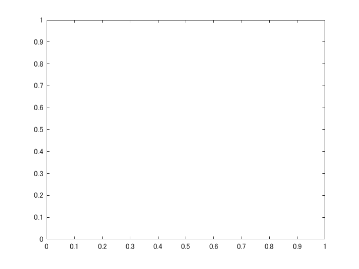
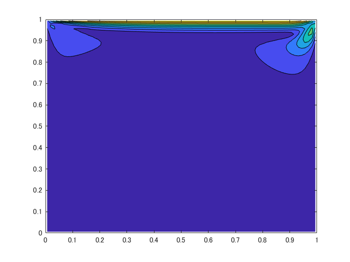
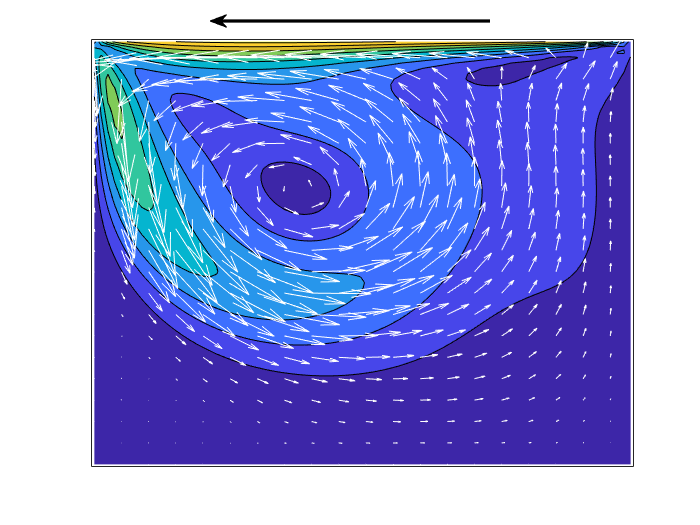

# 非圧縮性 Navier-Stokes 方程式の数値解法１：導入編


Copyright (c) 2020, The MathWorks, Inc.


# はじめに


Navier-Stokes 方程式を数値的に解きます。意外と簡単に流体シミュレーションできるんだな、、と思ってもらえると嬉しいです。


  
# この記事のゴール


ひとまず「導入偏」としてのゴールは


   -  以下の図を作ること 
   -  部分段階法（Fractional Step Method）法を理解すること 


離散化に際して Perot (1993) の境界条件の議論はあまり日本語で見かけないので、新しい情報になればと思います。


CFD に関わる方にとっては基本的なことかと思いますが、自分の経験は 2014年あたりで止まっているので当時を思い出しながら書いています。ご意見頂けると嬉しいです。


## 注意点


ここで紹介しているコードは、時間積分は一次精度のオイラー陽解法、拡散項も陽解法なので条件（Reynolds 数、グリッド数）を変えると発散します。それぞれへの対策についてはまた次回！


## 実行環境

   -  MATLAB R2019b 
   -  Signal Processing Toolbox (推奨*) 


*) ポワソン方程式を解く部分に Signal Processing Toolbox を使っていますが、直接法や反復法にすれば MATLAB 本体だけでOKです。


# なぜ MATLAB で CFD？


数値計算って結局行列計算なので MATLAB が得意な領域はず。可視化も簡単なので数値流体の導入としてはいいツールだと思います。


でも計算速度が・・という懸念もありますが R2015b 以降、計算エンジンが刷新され速くなっていると聞くし、MATLAB Coder や Parallel Computing Toolbox もうまく使えばそのまま大規模な計算もできるようなコードも自動生成できるのでは・・？という淡い期待もあります。


# シミュレーション対象


数値流体力学の "Hello World" 的課題。２次元の Lid-Driven cavity flow （キャビティ流れ）を計算します。画像検索すると沢山結果が変えてくることからもわかる通り、かなりやりつくされた対象です。Ghia 1982 [1] が良く参照されます。


ここでは定番通り非圧縮を仮定し、計算領域は正方形、そして境界条件は大変シンプルに上辺だけ横方向に速度があります。蓋が横にスライドするようなイメージです。内部の流体が引きずられて時計回りにぐるぐる回る想像がつきます。


話をさらに簡単にするため、計算グリッド（Staggerd Grid）は等間隔を想定します。流体の流入出がないので境界条件的に計算が楽です。また境界条件で遊んだりするややこしいところはまた次回以降。


  
# Navier-Stokes 方程式（非圧縮）


まずは支配方程式を数値的に解けるように離散化します。今回対象にする式はこちら


運動量保存と質量保存の式です。それぞれの項が意味するところは流体力学の教科書で復習して下さいませ。 圧力  の式が無いのが非圧縮性ならではの課題。


  
# Fractional Step Method（部分段階法）


ここでは部分段階法と呼ばれる方法で 2 段階に分けて解きます。


   1.  まず運動量の式から圧力項を取り除いた式で仮の速度場を求める。 
   1.  質量保存の式を満たすように仮の速度場を更新して新しい速度場とする。 


この手法自体は Harlow and Welch (1965) [2] や Chorin (1968) [3] などで提案されたと紹介されることが多く、MAC (Marker and Cell method) 法とも呼ばれます。圧力項を残したバージョンは SMAC (Simplified MAC) とか。この辺の歴史や呼び名は正直はっきり理解できていないのですが、詳しい方コメントください！時間発展の高精度化・安定化を図った Kim and Moin (1985) [4] の手法も実用的です。


## 仮の速度場の境界条件


ちなみにこの手法は 


> *serious confusion and/or disagreement concerning boundary conditions and the details of the methods implementation* (Perot 1993) [5]


などと、かつて議論が盛り上がっており、興味のある方は是非 Perot (1993) [5] を参照してみてください。境界条件を工夫した H. Le and P. Moin (1991) [6] なども面白いと思います。今となっては古い話なんでしょうけど。


個人的には Perot (1993) [5] や Chang (2002) [7] で紹介されている、離散化した Navier-Stokes 方程式の LU 分解をベースにした議論が気に入っているので、これをここでは採用します。**仮の速度場の境界条件なんて考える必要もない！**と鮮やかな見解を提示しています。


# 離散化手法


ここでは話を簡単にするために、思い切って 1 次精度のオイラーの陽解法で時間積分するとします。そうすると離散化した Navier-Stokes 方程式は


 


となり、行列で表現すると


こんな感じ。


ここで  は単位行列、 は対流項のオペレータ、 は圧力勾配を計算するオペレータ、 は発散を計算するオペレータ、 は発散を計算する際の速度の境界条件に起因する追加項、。そして  は、


です。


# LU 分解 から 部分段階法


ここから、上の式の左辺を LU 分解してみます（Perot 1993）。


ややこしくなってきた？


さらにここで、


と、左辺の右側２つを  (仮の速度場) で表現すると、


となります。


こう表現すると   (仮の速度場) 自体は  から切り離されます。2段階にわけて  と求めるのも自然に見えてきますね！


実際の処理順に並べると・・


となるわけです。上の行列式を展開しただけ。これで、部分段階法（Fractional Step Method) の出来上がり。


  
## 余談１：圧力に関してのポワソン方程式


よく聞く「圧力に関してのポワソン方程式」というのは２つ目の式のことです。ただ、ポワソン方程式に出てくる２階微分の離散オペレータはなんでもいいわけではなく、である必要がある点は大変重要。２次精度であれば（結局一致することが多いので）問題になることはないんですが、４次精度の場合はここに整合性がないと連続性（質量保存）が満たされません。


  
## 余談２：SMAC 法


この LU 分解という観点からは、部分段階法に圧力勾配項を加えた SMAC 法というのはなんとなくピンとこないですね。ちなみに以下のステップになります。


実質、圧力勾配を加えるだけ。


  
# 空間微分について


さて、次は空間微分についてです。


横方向の速度  は計算セルの左右辺の中央、縦方向の速度  は計算グリッドの上下辺の中央、そして圧力  はセルの中央に定義される Staggered Grid システムを使用します。


それぞれの定義位置と index の範囲を示したのが以下の図です。


黒い太線が計算領域の境界を表し、四隅と内部の様子を表現してみました。上の図で黒矢印は境界条件を表し、オレンジ矢印は境界条件と１つ内側の速度で決定する仮想速度とします。


という様に、境界を隔てて１つ内側の速度との内挿値が境界条件に一致するように決定します。実際に上で定義した支配方程式で解くのは水色矢印で表示されている境界内側の速度・圧力のみである点にご注意ください。


## 配列サイズとインデックスについて


コードを簡素化するために、境界条件と領域内部を同じ変数に持たせます。結果 index （要素位置）と配列サイズが少し変則的。


   -  u: (nx+1) x (ny+2) 
   -  v: (nx+2) x (ny+1) 
   -  p: (nx) x (ny) 


という配列サイズ。MATLAB だと例えば領域内部（実際に計算する部分）は


```matlab
u(2:end-1, 2:end-1)
v(2:end-1, 2:end-1)
p(1:end, 1:end)
```


など `end` を使うと多少参照しやすいです。


  
## 速度勾配（発散）


これはシンプルに２次精度の中央差分： に対して


であり、セル中央の  と同じ位置に定義されます。


**重要ポイント**：Staggered Grid においては の境界条件に関わる部分は  と別途取り扱うことで、境界条件は必要ないように オペレータを定義します。厳密にいうと  の境界に垂直な成分（流入出成分）に関わる部分が  に入りますので、今回のように流入出が 0 であれば 。


  
## 圧力勾配項


同じくシンプルに２次精度の中央差分： に対して


であり、それぞれ計算領域内の  と同じ位置に定義されます。


**重要ポイント**：Staggered Grid での２次精度の中央差分において  オペレータに境界条件は必要ありません。領域内の  だけで必要な勾配は求まります。 結果として圧力のポワソン方程式  を解くにあたって、圧力の境界条件は原理上不要というのが Perot (1993) の主張。


  
## 拡散項


これも２次精度の中央２階差分： それぞれに対して


であり、それぞれ計算領域内の  と同じ位置に定義されます。ここでは境界条件も含めたオペレータとしておきます。


  
## 対流項


これは、発散型や勾配型などと呼ばれる表現方法があります。数式で書くと発散型は


勾配型は


です。


質量保存の式（連続の式）が成り立っていれば本来等価な式なんですが、数値解の結果は異なることが指摘されています。また、２次精度の空間差分であれば単純ですが、高次精度にしようとすると整合性（互換性と保存性）を確保するのがなかな大変。ここに興味のある方は是非 Morinishi et al. (1998) [8] を見てみて。


今回は、発散型を使います。まず図のようにセルの中央（）とセルの角（）での速度を内挿で求め、それぞれを利用して


となします。これもまたそれぞれ計算領域内の  と同じ位置に定義されます。


# MATLAB による実装


細かいお話は以上！ではさっそくコードにしてみます。


```matlab
clear
close all
addpath('../functions/');
```
## 解析領域の設定


繰り返しになりますが今回は 1 次精度の陽解法。時間ステップサイズ dt を大きくしたり、Reynolds 数を小さくしすぎると拡散項が原因で計算が発散しちゃうので要注意。


```matlab
Re = 500; % Reynolds number
nt = 50; % max time steps (お試しで少しだけ)
Lx = 1; Ly = 1; % domain size
Nx = 80; Ny = 80; % Number of grids
dt = 0.01; % time step;
```


設定項目はここまで。


グリッドサイズやグリッドの中央（xce/yce）とコーナー（xco/yco）に当たる部分の座標位置を計算します。


```matlab
% Grid size (Equispaced)
dx = Lx/Nx;
dy = Ly/Ny;
% Coordinate of each grid (cell center)
xce = ((1:Nx)-0.5)*dx;
yce = ((1:Ny)-0.5)*dy;
% Coordinate of each grid (cell corner)
xco = (0:Nx)*dx;
yco = (0:Ny)*dy;
```


速度 u/v と圧力 p の配列を事前確保


```matlab
%% Data arrays
% Need pics of grid locations (ToDo)
u = zeros(Nx+1,Ny+2); % velocity in x direction (u)
v = zeros(Nx+2,Ny+1); % velocity in y direction (v)
p = zeros(Nx,Ny); % pressure (lagurange multiplier)
```
## 初期状態プロット


セル中央での速度


```matlab
uce = (u(1:end-1,2:end-1)+u(2:end,2:end-1))/2; % u at cell center
vce = (v(2:end-1,1:end-1)+v(2:end-1,2:end))/2; % v at cell center
```


速度の大きさ（速さ）を等高線図でプロットします。


```matlab
[Xce,Yce] = meshgrid(xce,yce); % cell centerの座標グリッド
[~,h_abs] = contourf(Xce',Yce',sqrt(uce.^2+vce.^2));
```
```
警告: 等高線図は ZData が定数の場合はレンダリングされません
```
```matlab
xlim([0 Lx]); ylim([0 Ly]);
```




ま、、当然ながら初期状態では何の動きもありません。


## 時間積分


ここからメインループ


```matlab
for ii = 1:nt
```
### 仮想速度部分（境界からはみ出た部分）


境界条件を利用して計算します。


```matlab
    bctop = 1; % 境界上部の速度 u
    u(:,1) = -u(:,2); v(:,1) = 0;             %bottom
    u(:,end) = 2*bctop-u(:,end-1);  v(:,end) = 0;  %top
    u(1,:) = 0;    v(1,:) = -v(2,:);             %left
    u(end,:) = 0;  v(end,:) = -v(end-1,:);    %right
```
###  拡散項(u) 


```matlab
    Lux = (u(1:end-2,2:end-1)-2*u(2:end-1,2:end-1)+u(3:end,2:end-1))/dx^2; % nx-1 * ny
    Luy = (u(2:end-1,1:end-2)-2*u(2:end-1,2:end-1)+u(2:end-1,3:end))/dy^2; % nx-1 * ny
```
### 拡散項(v)


```matlab
    Lvx = (v(1:end-2,2:end-1)-2*v(2:end-1,2:end-1)+v(3:end,2:end-1))/dx^2; % nx * ny-1
    Lvy = (v(2:end-1,1:end-2)-2*v(2:end-1,2:end-1)+v(2:end-1,3:end))/dy^2; % nx * ny-1
```
### 対流項の計算


```matlab
    % 1. interpolate velocity at cell center/cell cornder
    uce = (u(1:end-1,2:end-1)+u(2:end,2:end-1))/2;
    uco = (u(:,1:end-1)+u(:,2:end))/2;
    vco = (v(1:end-1,:)+v(2:end,:))/2;
    vce = (v(2:end-1,1:end-1)+v(2:end-1,2:end))/2;
    
    % 2. multiply
    uuce = uce.*uce;
    uvco = uco.*vco;
    vvce = vce.*vce;
    
    % 3-1. get derivative for u
    Nu = (uuce(2:end,:) - uuce(1:end-1,:))/dx;
    Nu = Nu + (uvco(2:end-1,2:end) - uvco(2:end-1,1:end-1))/dy;
    % 3-2. get derivative for v
    Nv = (vvce(:,2:end) - vvce(:,1:end-1))/dy;
    Nv = Nv + (uvco(2:end,2:end-1) - uvco(1:end-1,2:end-1))/dx;
    
```
###  仮の速度場算出


一次精度のオイラー積分


```matlab
    % Get intermidiate velocity
    u(2:end-1,2:end-1) = u(2:end-1,2:end-1) + dt*(-Nu + (Lux+Luy)/Re);
    v(2:end-1,2:end-1) = v(2:end-1,2:end-1) + dt*(-Nv + (Lvx+Lvy)/Re);
```
### 新しい速度場


圧力の式（ポワソン方程式）を解いて速度場を質量保存を満たす場に写像。ポワソン方程式の解法については「[離散コサイン変換でポアソン方程式を高速に解く](https://qiita.com/eigs/items/cb607d647bc20c7db809)」で紹介しているので参照してください。


```matlab
    % velocity correction
    % RHS of pressure Poisson eq.
    b = ((u(2:end,2:end-1)-u(1:end-1,2:end-1))/dx ...
        + (v(2:end-1,2:end)-v(2:end-1,1:end-1))/dy);
    
    % Solve for p（コサイン変換を使います：高速）
    p = solvePoissonEquation_2dDCT(b,Nx,Ny,dx,dy);
    
    % 直接法で解く場合も参考まで
    % p = solvePoissonEquation_direct(b,Nx,Ny,dx,dy);
    
    % 圧力勾配を仮の速度場から引いて、新しい速度場
    u(2:end-1,2:end-1) = u(2:end-1,2:end-1) -  (p(2:end,:)-p(1:end-1,:))/dx;
    v(2:end-1,2:end-1) = v(2:end-1,2:end-1) -  (p(:,2:end)-p(:,1:end-1))/dy;
```


新しい速度場は連続の式を満たします。この処理で境界値は変化しない点にも注目。むしろ境界値が前提に、仮の速度場を連続の式を満たすように処理したと理解したほうがいいかも。


### 可視化アップデート


セル中央での速度場を内挿で求めて表示！


```matlab
    % get velocity at the cell center (for visualization)
    uce = (u(1:end-1,2:end-1)+u(2:end,2:end-1))/2;
    vce = (v(2:end-1,1:end-1)+v(2:end-1,2:end))/2;
    
    % update plot
    h_abs.ZData = sqrt(uce.^2+vce.^2);
    drawnow
end
```




うまく計算できてそうですね！


連続の式を満たした速度場になっているかどうか、一応確認しておきます。


```matlab
b = ((u(2:end,2:end-1)-u(1:end-1,2:end-1))/dx ...
    + (v(2:end-1,2:end)-v(2:end-1,1:end-1))/dy);
disp(norm(b))
```
```
   5.8843e-14
```


浮動小数点誤差程度に収まっていますね。


# 流れ場のアニメーション表示


CFD は Colorful Fluid Dynamics の略とも言われるだけあって、可視化が数値流体の醍醐味ですよね。等高線図だけじゃなくて速度を矢印で表示させて GIF 出力します。上の計算処理は `updateVelocityField_Euler_bctop.m` として関数化しておきます。


**注意**：R2019b では `recordGIF = true` 設定で以下を実行するとエラーが発生します。GIFを作成する場合には `script_AnimateVelocityField.m` （同じ内容です）を実行してください。


環境設定


```matlab
Re = 500; % Reynolds number
nt = 2000; % max time steps
Lx = 1; Ly = 1; % domain size
Nx = 80; Ny = 80; % Number of grids
dt = 0.01; % time step;
% Grid size (Equispaced)
dx = Lx/Nx;
dy = Ly/Ny;
% Coordinate of each grid (cell center)
xce = ((1:Nx)-0.5)*dx;
yce = ((1:Ny)-0.5)*dy;
% Coordinate of each grid (cell corner)
xco = (0:Nx)*dx;
yco = (0:Ny)*dy;
```


速度場の初期化


```matlab
figure
u = zeros(Nx+1,Ny+2); % velocity in x direction (u)
v = zeros(Nx+2,Ny+1); % velocity in y direction (v)
uce = (u(1:end-1,2:end-1)+u(2:end,2:end-1))/2; % u at cell center
vce = (v(2:end-1,1:end-1)+v(2:end-1,2:end))/2; % v at cell center
```
## 可視化設定


矢印は `quiver` 関数で描けるんですが、矢印が多いと見づらいので `visRate` 間隔で間引いて表示させます。また毎ステップ可視化すると GIF が重くなるので、`recordRate` 毎に表示更新して GIF に書き込むようにします。


```matlab
visRate = 4; % downsample rate of the data for quiver
recordGIF = false; % GIF 作成する場合は true に変更
recordRate = 20;
filename = 'animation_sample.gif'; % Specify the output file name
```


等高線図


```matlab
figure
[Xce,Yce] = meshgrid(xce,yce); % cell centerの座標グリッド
[~,h_abs] = contourf(Xce',Yce',sqrt(uce.^2+vce.^2)); % 等高線図
```
```
警告: 等高線図は ZData が定数の場合はレンダリングされません
```
```matlab
hold on
```


速度場（矢印）


```matlab
% 表示用にデータを間引きます（d = downsampled）
xced = xce(1:visRate:end);
yced = yce(1:visRate:end);
[Xced,Yced] = meshgrid(xced, yced);

uced = uce(1:visRate:end,1:visRate:end);
vced = vce(1:visRate:end,1:visRate:end);
h_quiver = quiver(Xced',Yced',uced,vced,3,'Color',[1,1,1]);

hold off
xlim([0 Lx]); ylim([0 Ly]);
```


おまけで領域上部の速度（境界条件）も矢印で表示しておきます。


```matlab
harrow = annotation('textarrow',[0.3 0.7],[0.96 0.96],"LineWidth",2);
```


余計なものは消しておきましょう。


```matlab
haxes = gca;
haxes.XTick = [];
haxes.YTick = [];
```
## シミュレーション開始


ここでは少し動きを出すために、 2000 ステップ回す途中で領域上部の速度を反転させています。


```matlab
initialFrame = true;

for ii = 1:nt
    bctop = 1; % 境界上部の速度 u
    
    if ii > 1000
        bctop = -1;
        harrow.X = [0.7, 0.3]; % 矢印の向きも反転
    end
    
    % 速度場更新（コサイン変換使用）
    [u,v] = updateVelocityField_Euler_bctop(u,v,Nx,Ny,dx,dy,Re,dt,bctop,'dct');
    
    % 描画は recordRate 毎に実施
    if mod(ii,recordRate) == 0
        % get velocity at the cell center (for visualization)
        uce = (u(1:end-1,2:end-1)+u(2:end,2:end-1))/2; % u at cell center
        vce = (v(2:end-1,1:end-1)+v(2:end-1,2:end))/2; % v at cell center
        % update plot (downsample)
        h_quiver.UData = uce(1:visRate:end,1:visRate:end);
        h_quiver.VData = vce(1:visRate:end,1:visRate:end);
        h_abs.ZData = sqrt(uce.^2+vce.^2);
        
        drawnow
        
        if recordGIF
            frame = getframe(gcf); %#ok<UNRCH> % Figure 画面をムービーフレーム（構造体）としてキャプチャ
            tmp = frame2im(frame); % 画像に変更
            [A,map] = rgb2ind(tmp,256); % RGB -> インデックス画像に
            if initialFrame
                imwrite(A,map,filename,'gif','LoopCount',Inf,'DelayTime',0.1);
                initialFrame = false;
            else
                imwrite(A,map,filename,'gif','WriteMode','append','DelayTime',0.1);% 画像をアペンド
            end
        end
        
    end
end
```



  
# まとめ


まだ精度の検証などしていませんが、Navier-Stokes 方程式が解けた気がします。


拡散項の取り扱いが陽解法であることもあり、Reynolds 数を小さくすると見事に計算が発散します。良ければ試してみてください。次回はその辺への対策として拡散項の陰解法、そして時間積分の高次精度化を実装してみます。次回、本当に正しく解けているかもちゃんと検証しましょう。


「非圧縮性 Navier-Stokes 方程式の数値解法２：拡散項の陰解法＋時間積分の高次化」が楽しみな、趣味の合う方がいらっしゃいましたら、いいねで応援してください :)


# References


[1] U. Ghia, K.N. Ghia and C.T. Shin, High-Re solutions for incompressible flow using the Navier-Stokes equations and a multigrid method. J. Comput. Physics, 48, 387-411, 1982.


[2] F. Harlow and E. Welch, Numerical calculation of time-dependent viscous incompressible flow of fluid with free surface. Physics of Fluids 8: 2182-2189, 1965.


[3] AJ. Chorin, Numerical solution of the Navier-Stokes equations. Mathematical Computations 22: 745-762, 1968.


[4] J. Kim and P. Moin. Application of a fractional-step method to incompressible Navier-Stokes equations. J. Comput. Physics, 59(2): 308-323, 1985.


[5] B. Perot, An analysis of the fractional step method. J. Comp. Physics, 108: 51-58, 1993


[6] H. Le and P. Moin. An improvement of fractional step methods for the incompressible Navler-Stokes equations. J. Comput. Physics, 92: 369-379, 1991


[7] W. Chang, F. Giraldo, and B. Perot. Analysis of an exact fractional step method. J. Compt. Physics, 180(1): 183-199, 2002.


[8] Y. Morinishi, T.S. Lund, O.V. Vasilyev, and P. Moin. Fully conservative higher order finite difference schemes for incompressible flow. Journal of Computational Physics 143 (1), 90-124. 1998


