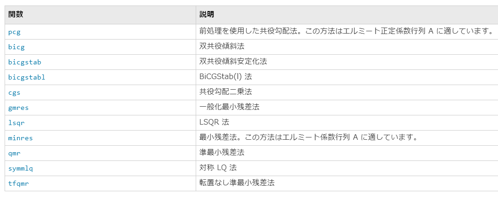
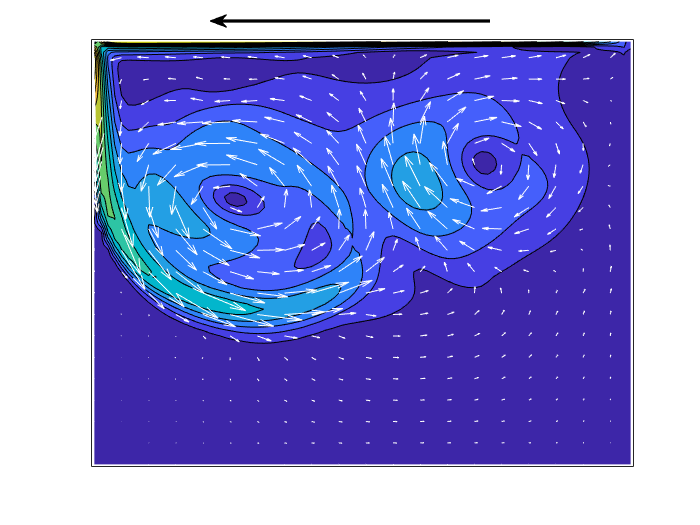

# 非圧縮性 Navier-Stokes 方程式の数値解法２：拡散項の陰解法


Copyright (c) 2020, The MathWorks, Inc.


# はじめに


Navier-Stokes 方程式を数値的に解くシリーズ、第２回目です。


   -  非圧縮性 Navier-Stokes 方程式の数値解法１：導入編 
   -  **非圧縮性 Navier-Stokes 方程式の数値解法２：拡散項の陰解法** 

# この記事のゴール


解析対象については前回の記事（非圧縮性 Navier-Stokes 方程式の数値解法１：導入編）を参照してください。


導入編ではまずキャビティ流れを解いてみることに注力して、かなり荒い離散化を行いました。結果として、時間ステップサイズによっても変わりますが、ちょうどよい Reynolds 数（Re = 500程度）以外では発散する結果になっています。


今回はそこを解決するために以下を実施します。


   -  拡散項について陰解法（２次精度クランク・ニコルソン法）を実装 
   -  対流項について２段階の陽解法（２次精度アダムス・バッシュフォース法）を実装 
   -  高レイノルズ数でのシミュレーション（下図 Re = 5,000） 


実際のところルンゲ・クッタ法の方が一般的かと思いますのでそちらも実装しています。文末 Appendix 参照。


**メモ：**拡散項への陰解法の導入だけで事足りるかと期待したんですが、高レイノルズ数では発散しちゃいました。諦めて移送項も改良することにします。


## 実行環境

   -  MATLAB R2019b 
   -  Signal Processing Toolbox (推奨*) 


*) ポワソン方程式を解く部分に Signal Processing Toolbox を使っていますが、直接法や反復法にすれば MATLAB 本体だけでOKです。


  
# 拡散項と対流項の安定性


この辺はノイマンの安定解析やクーラン数（Courant number）の話。CFD の教科書には必ず出てくるネタですね。ここでは要点だけ触れておくと、拡散方程式のオイラー陽解法・中央差分における安定性条件は


であり、グリッドサイズを 1/2 倍にすると時間ステップ（）は 1/4 にしなければいけません。また低レイノルズ数の方が条件が厳しい。前回の手法が発散した理由はこれ。拡散方程式については陰解法を使えば無条件安定になることが知られています。


また同様に移送方程式についてはクーラン数（c は移送速度）


が絡んできます。ただこちらはグリッドサイズを 1/2 倍にすると時間ステップ（）も 1/2 倍ということで条件はそこまで悪くない。 この記事では対流項に２次精度アダムス・バッシュフォース法を用いて、クーラン数は 0.5 を超えないような時間ステップを使います。


**メモ**：ルンゲ・クッタ法を使うとクーラン数 1.2 くらいでも発散はしない印象（あくまで観測ベース）


  
# 陰解法による部分段階法
## 前回の復習から


前回は 1 次精度のオイラーの陽解法で時間積分したので、離散化した Navier-Stokes 方程式を行列で表現した結果、


 


そして行列で表現すると


こんな感じでした。


## クランク・ニコルソン法とアダムスバッシュフォース法


ここで、拡散項にクランク・ニコルソン法、対流項にアダムスバッシュフォース法を適用すると


こうなります。式が長くなりましたが基本的な構造は同じ。拡散項に次の時間の速度場（）が含まれていて、陰解法である点にご注目。 は発散を計算する際に速度境界条件に起因する追加項、 は拡散項における追加項です。


前回と同じく行列で表現すると


ここで と  は


となります。


## まずは LU 分解から


また LU 分解してみます（Perot 1993 [1]）


これを厳密に解くのは現実的ではないので、通常  は近似して解きます。この近似方法で部分段階法の形が変わってきます。クラッシックな部分段階法は  と近似したものと同値で時間積分は１次精度。


  


**メモ**：ちなみに  と近似すると２次精度となりそうですが、 の処理が大変そう・・ここへは踏み込みません。


## 部分段階法の完成


処理を書き下すと陰解法による部分段階法（Fractional Step Method) の出来上がり。


前回と違う部分は第一式だけ。改めて明記すると、


です。


速度勾配（）、圧力勾配（）、対流項（）、拡散項（）の計算方法自体は前回から変わりませんが、上で紹介した通り今回は仮の速度場を求めるのに、 それぞれについて連立方程式  を解く必要があります。


  


**メモ**：ここで要注目ポイントは  の式に含まれる  の項です。次の時間ステップ（）の境界条件は右辺に残し、 オペレータはあくまで計算対象である領域内の速度にかかるものであるので注意。


# MATLAB による陰解法の実装


実際のコードは GitHub の方を見て頂くとして、ここでは要点だけ紹介します。ポイントは


   -  拡散項に関わる行列の確認 
   -  境界条件の取り扱い 
   -  連立方程式の解き方 


の３つ。前回のオイラー法との違いは仮の速度場を算出するここだけ。


コードとしてはこんな感じ（`updateVelocityField_CNAB.m` 参照）


**今回**


```matlab:Code(Display)
    % Implicit treatment for xy direction
    b = u(2:end-1,2:end-1) + dt*(-3*Nu+Nu_old)/2 + dt/(2*Re)*(Lux+Luy+Lubc);
    xu = getIntermediateU_xyCNAB(u, b, dt, Re, Nx, Ny, dx, dy);
    b = v(2:end-1,2:end-1) + dt*(-3*Nv+Nv_old)/2 + dt/(2*Re)*(Lvx+Lvy+Lvbc);
    xv = getIntermediateV_xyCNAB(v, b, dt, Re, Nx, Ny, dx, dy);
    
    u(2:end-1,2:end-1) = xu;
    v(2:end-1,2:end-1) = xv;
```


**ちなみに前回**（`updateVelocityField_Euler.m` 参照**）**


```matlab:Code(Display)
    u(2:end-1,2:end-1) = u(2:end-1,2:end-1) - dt*Nu + dt/Re*(Lux+Luy);
    v(2:end-1,2:end-1) = v(2:end-1,2:end-1) - dt*Nv + dt/Re*(Lvx+Lvy);
```


`getIntermediateU_xyCNAB.m `と `getIntermediateV_xyCNAB.m `にすべてが詰まっています。CNAB は Crank-Nicolson, Adams-Bashforth の略です。


## 拡散項オペレータ


行列 に含まれる  についてみてみます。差分式は


ということで、２次精度であれば局所的には三重対角行列ですが、x, y の両方向に対して陰解法とするとなると、もう少し広がりのあるスパース行列となります。行列のサイズは


 については 


 については 


と要素の数的には  ですが  重のスパースな帯行列ではあります。


・・まぁまぁ大変そうですね。とでサイズが違うのは Staggered-grid のややこしいところ。


  
### 余談：片方にだけ陰解法？


例えば境界層流れなどで一次元方向のみにグリッドを細かくするような場合は、その方向の拡散成分にだけ陰解法を用いる (Simens et al. 2009 [2]) というケースもあります。その場合は大規模な連立方程式とはいえ、３重帯行列（２次精度の場合）なので直接法でも十分速いので、計算速度が気になる場合にはこの辺を妥協するのもアリです。


  
## 境界条件について


境界条件に由来する  について考えます。まず変数の定義位置と index の範囲を確認します。


ここでオレンジ色の矢印で表される仮想速度は以下のように計算されます。例えば、


境界を挟んだ２つの速度の平均値（2次精度の内挿）が境界値となるという想定です。


この計算に領域内の速度（ここでは ）が含まれるため、境界の取り扱いが  の定義に影響します。例えば  に対する y 方向の拡散項は下部境界において


と展開され、y 方向の  の要素として -3 が入ってきます。あふれた  の項が  に入ります。


また x 方向の拡散項は左側の境界付近において


であり、仮想速度は必要ないので x 方向の  の要素に関しては境界条件にかかる係数を含めないだけで OK。


速度  に関しては x,y 方向の取り扱いが上の逆になります。 の仮想速度は x 方向の拡散項にかかるので・・。ややこしい！


## 実際の行列確認


小さいグリッド数で、実際にどんな行列か見てみます。`getL4u.m` は  に関する  オペレータを求める関数です。


```matlab:Code
clear, close all
addpath('../functions/')

Lx = 1; Ly = 1;
nx = 5; ny = 5;
dx = Lx/nx; dy = Ly/ny;
maskU = false(nx+1,ny+2);
maskU(2:end-1,2:end-1) = true;
L4u = getL4u(nx,ny,dx,dy,maskU);
spy(L4u);
```


スパースですね。参考まで、冒頭の数値を確認。


```matlab:Code
full(L4u(1:nx,1:nx))
```


```text:Output
ans = 5x5    
 -125.0000   25.0000         0         0   25.0000
   25.0000 -125.0000   25.0000         0         0
         0   25.0000 -125.0000   25.0000         0
         0         0   25.0000 -125.0000         0
   25.0000         0         0         0 -100.0000

```


**メモ**：ここで `maskU` は速度  が定義されている場所で `true` を持つ行列。より複雑な計算領域（領域内に障害物があったり・・）しても、 `maskU` さえ定義すれば  オペレータ（行列）を計算できるようにという気持ちです。


```matlab:Code
maskU
```


```text:Output
maskU = 6x7 の logical 配列    
   0   0   0   0   0   0   0
   0   1   1   1   1   1   0
   0   1   1   1   1   1   0
   0   1   1   1   1   1   0
   0   1   1   1   1   1   0
   0   0   0   0   0   0   0

```


こんな行列。境界（0）で囲まれているだけのシンプルなものですね。


## 連立方程式の解法


連立方程式  を解くのは MATLAB が得意とするところですので関連する関数は沢山あります。今回は３つ実装してみました。実装は `getIntermediateU_xyCNAB.m` を見てください。速度の比較など細かい検証はまた次回以降に持ち越します。


上で見た通り  はスパース行列。


```matlab:Code
dt = 0.01; Re = 100;% お試し設定
A4u = eye(size(L4u),'like',L4u)-dt/(2*Re)*L4u; % A matrix for u 
spy(A4u)
```


### 方法１：直接法


MATLAB の関数は入力がスパース行列であればスパース行列用のアルゴリズムを（勝手に）使ってくれます。


```matlab:Code
r = rand(nx-1,ny); % 試しに右辺を乱数で
xu = A4u\r(:);
```

### 方法２：行列分解＋直接法


もし時間ステップ `dt` とレイノルズ数 `Re` が変わらなければ、事前に  を分解（LU、LDL、コレスキー、QR など）しておくことで、直接法が**かなり高速化**されます。


[decomposition オブジェクト](https://jp.mathworks.com/help/matlab/ref/decomposition.html)は、分解手法を入力行列のプロパティに基づいて自動的に選択してくれるので、実装方法は以下の通り一行追加するだけです。


```matlab:Code
A4u = decomposition(A4u); 
xu1 = A4u\r(:);
```


行列分解を毎回計算すると本末転倒なので、ここは初回だけ計算するように [persistent 変数](https://jp.mathworks.com/help/matlab/ref/persistent.html)（永続変数）として定義するのもミソ。


### 方法３：反復法


最後に反復法。ここにも [11 個のアルゴリズム](https://jp.mathworks.com/help/matlab/math/systems-of-linear-equations.html#brzoiix)が用意されています。選択肢がありすぎてむしろ困ります。





ここはひとまず対称行列も正定行列も要求しない `cgs`（共役傾斜二乗法）で。


```matlab:Code
A4u = eye(size(L4u),'like',L4u)-dt/(2*Re)*L4u;
xu2 = cgs(A4u,r(:));
```


```text:Output
cgs は、相対残差 5.4e-11 をもつ解に 反復 2 で収束しました。
```


前処理条件をうまく使えば高速化できそうですが、ここでも「時間ステップ `dt` とレイノルズ数 `Re` が変わらなければ」という条件が必要です。


### おまけ：反復法


反復法の良いところは行列を明示的に用意する必要はないところ。


```matlab:Code
xu4 = cgs(@(x) operatorAu_CNAB(x,dt,Re,nx,ny,dx,dy),r(:));
```


```text:Output
cgs は、相対残差 5.4e-11 をもつ解に 反復 2 で収束しました。
```


みたいに を計算する関数（ここでは `operatorAu_CNAB.m` ）を第一引数に与えるのも可。


```matlab:Code(Display)
Ax = x - dt/(2*Re)*(xbig(1:end-2,2:end-1)-2*xbig(2:end-1,2:end-1)+xbig(3:end,2:end-1))/dx^2; % nx-1 * ny
Ax = Ax - dt/(2*Re)*(xbig(2:end-1,1:end-2)-2*xbig(2:end-1,2:end-1)+xbig(2:end-1,3:end))/dy^2; % nx-1 * ny
Ax = Ax(:);
```


という風に差分式のまま書き出せるので簡単です。


# 流れ場のアニメーション表示


さて、以上の手法を使って のキャビティ流れをアニメーション表示してみましょう。


ここでは少し動きを出すために、 3000 ステップ回す途中で領域上部の速度を反転させています。ここまでの速度場を更新する計算処理は `updateVelocityField_CNAB.m` として関数化しておきます。


**注意**：R2019b では `recordGIF = true` 設定で以下を実行するとエラーが発生します。GIFを作成する場合には `script_AnimateVelocityField_part2.m` （以下と同じ内容です）を実行してください。


**可視化設定****`：`**矢印は `quiver` 関数で描けるんですが、矢印が多いと見づらいので `visRate` 間隔で間引いて表示させます。また毎ステップ可視化すると GIF が重くなるので、`recordRate` 毎に表示更新して GIF に書き込むようにします。


```matlab:Code
visRate = 4; % downsample rate of the data for quiver
recordGIF = false; % GIF 作成する場合は true に変更
recordRate = 20;
filename = 'animation_part2.gif'; % Specify the output file name
```


**環境設定**


```matlab:Code
Re = 5000; % Reynolds number
nt = 3000; % max time steps
Lx = 1; Ly = 1; % domain size
Nx = 80; Ny = 80; % Number of grids
dt = 0.003; % time step;
% Grid size (Equispaced)
dx = Lx/Nx;
dy = Ly/Ny;
% Coordinate of each grid (cell center)
xce = ((1:Nx)-0.5)*dx;
yce = ((1:Ny)-0.5)*dy;
% Coordinate of each grid (cell corner)
xco = (0:Nx)*dx;
yco = (0:Ny)*dy;
```


**速度場の初期化**


```matlab:Code
figure
u = zeros(Nx+1,Ny+2); % velocity in x direction (u)
v = zeros(Nx+2,Ny+1); % velocity in y direction (v)
uce = (u(1:end-1,2:end-1)+u(2:end,2:end-1))/2; % u at cell center
vce = (v(2:end-1,1:end-1)+v(2:end-1,2:end))/2; % v at cell center
```


**等高線図**


```matlab:Code
figure
[Xce,Yce] = meshgrid(xce,yce); % cell centerの座標グリッド
[~,h_abs] = contourf(Xce',Yce',sqrt(uce.^2+vce.^2)); % 等高線図
```


```text:Output
警告: 等高線図は ZData が定数の場合はレンダリングされません
```


```matlab:Code
h_abs.LevelList = linspace(0,0.6,12);
hold on
```


**速度場（矢印）**


```matlab:Code
% 表示用にデータを間引きます（d = downsampled）
xced = xce(1:visRate:end);
yced = yce(1:visRate:end);
[Xced,Yced] = meshgrid(xced, yced);

uced = uce(1:visRate:end,1:visRate:end);
vced = vce(1:visRate:end,1:visRate:end);
h_quiver = quiver(Xced',Yced',uced,vced,3,'Color',[1,1,1]);

hold off
xlim([0 Lx]); ylim([0 Ly]);
```


おまけで領域上部の速度（境界条件）も矢印で表示しておきます。


```matlab:Code
harrow = annotation('textarrow',[0.3 0.7],[0.96 0.96],"LineWidth",2);
```


余計なものは消しておきましょう。


```matlab:Code
haxes = gca;
haxes.XTick = [];
haxes.YTick = [];
haxes.CLim = [0,0.6];
```


**シミュレーション開始**


```matlab:Code
initialFrame = true;

for ii = 1:nt
    bctop = 1; % 境界上部の速度 u
    
    if ii > 1000
        bctop = -1;
        harrow.X = [0.7, 0.3]; % 矢印の向きも反転
    end
    
    % 速度場更新（コサイン変換使用）
    [u,v] = updateVelocityField_CNAB_bctop(u,v,Nx,Ny,dx,dy,Re,dt,bctop,'dct');
%     [u,v] = updateVelocityField_RK3_bctop(u,v,Nx,Ny,dx,dy,Re,dt,bctop,'dct');
    
    % 描画は recordRate 毎に実施
    if mod(ii,recordRate) == 0
        % get velocity at the cell center (for visualization)
        uce = (u(1:end-1,2:end-1)+u(2:end,2:end-1))/2; % u at cell center
        vce = (v(2:end-1,1:end-1)+v(2:end-1,2:end))/2; % v at cell center
        % update plot (downsample)
        h_quiver.UData = uce(1:visRate:end,1:visRate:end);
        h_quiver.VData = vce(1:visRate:end,1:visRate:end);
        h_abs.ZData = sqrt(uce.^2+vce.^2);
        
        drawnow
        
        if recordGIF
            frame = getframe(gcf); %#ok<UNRCH> % Figure 画面をムービーフレーム（構造体）としてキャプチャ
            tmp = frame2im(frame); % 画像に変更
            [A,map] = rgb2ind(tmp,256); % RGB -> インデックス画像に
            if initialFrame
                imwrite(A,map,filename,'gif','LoopCount',Inf,'DelayTime',0.1);
                initialFrame = false;
            else
                imwrite(A,map,filename,'gif','WriteMode','append','DelayTime',0.1);% 画像をアペンド
            end
        end
        
    end
end
```




  
# まとめ


また精度の検証は先延ばしにしますが、高 Reynolds 数がシミュレーションできるようになった模様です。


今回はクランク・ニコルソン法とアダムス・バッシュフォース法を紹介しました。陰解法ではあるものの、高レイノルズ数ではエネルギーの散逸力が足りず時間ステップを小さくしないと発散してしまうケースがみられました。


もし試してみて「発散する！」とか「時間ステップが小さすぎてシミュレーションが進まない・・」ということであればおまけで3段階のルンゲ・クッタも実装してますのでそちらを試してください。


```matlab:Code(Display)
    [u,v] = updateVelocityField_CNAB_bctop(u,v,Nx,Ny,dx,dy,Re,dt,bctop,'dct');
```


の部分を


```matlab:Code(Display)
    [u,v] = updateVelocityField_RK3_bctop(u,v,Nx,Ny,dx,dy,Re,dt,bctop,'dct');
```


に変えてください。


次回「非圧縮性 Navier-Stokes 方程式の数値解法３：境界条件で遊ぶ」では、境界条件に自由度を持たせてキャビティ流れ以外もシミュレーションできるようにします。今度こそ精度検証も行います。


興味のある方いらっしゃいましたら、LGTM で応援してください :)


# Appendix: ルンゲ・クッタ法


Spalart et al. (1991) [3] で紹介されているルンゲ・クッタ法（３段階の半陰解法）も実装してみました。`updateVelocityField_RK3.m` を見てください。


`dt` 時間ステップ進むのに３倍の計算量を使いますが、安定する分 `dt` を大きくできるメリットがあります。具体的な式と係数は以下の通り。


ここで


です。


# References


[1] B. Perot, An analysis of the fractional step method. J. Comp. Physics, 108: 51-58, 1993


[2] Simens, M.P., Jim´enez, J., Hoyas, S. and Mizuno, Y. 2009 A high-resolution code for turbulent boundary layers. Journal of Computational Physics 228 (11), 4218-4231.


[3] Spalart, P.R., Moser, R.D. and Rogers, M.M. 1991 Spectral methods for the Navier-Stokes equations with one infinite and two periodic directions. Journal of Computational Physics 96 (2), 297-324.


